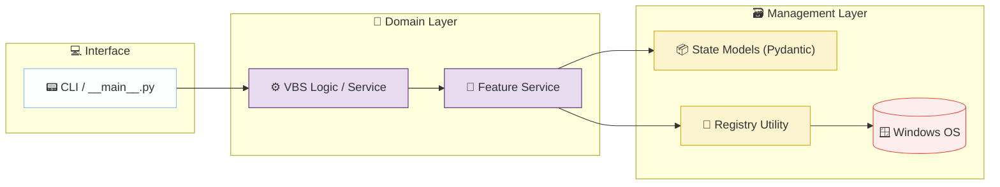

# 🛠️ Coding Guide — Standard Operating Procedure

> **Step-by-step developer guide** for adding new features and modules. This file ensures both human developers and AI agents follow the project's established architecture, design patterns, and conventions exactly.

---

## 🏗️ Architecture Overview

---

## 📋 Step-by-Step: Adding a New Feature

### Step 1 — Define the Data Model

| Action | Details |
| :--- | :--- |
| **Where** | `src/models/` |
| **Convention** | Use Pydantic `BaseModel` for validation and state representation. |
| **Example** | `src/models/security_state.py` |

### Step 2 — Implement Registry Logic

| Action | Details |
| :--- | :--- |
| **Where** | `src/utils/registry_ops.py` |
| **Convention** | Use `pywin32` for raw registry access. Wrap in safe try-except blocks. |

### Step 3 — Create the Feature Service

| Action | Details |
| :--- | :--- |
| **Where** | `src/services/` |
| **Convention** | Orchesrate the logic for a specific Windows feature (e.g., Memory Integrity). |
| **Base Pattern** | `class [FeatureName]Service` |

### Step 4 — Register in CLI

| Action | Details |
| :--- | :--- |
| **Where** | `src/cli.py` |
| **Action** | Add a new command/argument to toggle or status the new feature. |
| **Library** | Use `argparse` for standard CLI parsing. |

---

## 🧪 Testing Standard

All logic must be unit tested in `tests/services/`. Since we interact with the Windows Registry, mock the `registry_ops.py` utility to ensure tests can run on any OS and don't modify the host system.

| Action | Details |
| :--- | :--- |
| **Where** | `[TODO: e.g., app/services/]` |
| **Convention** | `[TODO: e.g., FeatureService injecting FeatureRepository]` |
| **Error handling** | `[TODO: e.g., raise FeatureNotFoundError, DuplicateFeatureError]` |

### Step 5 — Create the Route Handler / Controller

| Action | Details |
| :--- | :--- |
| **Where** | `[TODO: e.g., app/api/v1/endpoints/]` |
| **Convention** | `[TODO: e.g., thin handler delegating to service layer]` |
| **URL pattern** | `[TODO: e.g., /api/v1/features, /api/v1/features/{id}]` |

### Step 6 — Register Dependencies

| Action | Details |
| :--- | :--- |
| **Where** | `[TODO: e.g., dependency provider functions, Program.cs, ServiceProvider]` |
| **What to register** | Repository, Service, and any new dependencies |

### Step 7 — Create Database Migration

| Action | Details |
| :--- | :--- |
| **Tool** | `[TODO: e.g., Alembic, EF Core Migrations, Laravel Artisan]` |
| **Command** | `[TODO: e.g., alembic revision --autogenerate -m "add features table"]` |

### Step 8 — Write Tests

| Action | Details |
| :--- | :--- |
| **Where** | `[TODO: e.g., tests/services/, tests/api/]` |
| **Framework** | `[TODO: e.g., pytest, xUnit, PHPUnit]` |
| **Coverage** | Unit tests for service logic, integration tests for API endpoints |

---

## 🧩 End-to-End Reference Example

> **[TODO: Provide a complete, working code example of a standard feature (e.g., a "Task" or "Note" CRUD module) that demonstrates every layer described above. This serves as the canonical baseline that AI agents must reference and adapt for all future features.]**
>
> Include the following files in the example:
> 1. Model / Entity
> 2. Validation / Schema (request + response)
> 3. Repository
> 4. Service
> 5. Route handler / Controller
> 6. Dependency registration
> 7. Migration command
> 8. Tests (at least one happy path + one error case)

---

## ✅ Feature Checklist

Before considering a feature complete, verify:

- [ ] Model/Entity created with proper types and relationships
- [ ] Request and response schemas defined with validation rules
- [ ] Repository created with all necessary CRUD methods
- [ ] Service layer contains all business logic (controller/handler is thin)
- [ ] Route handler registered with correct HTTP methods and status codes
- [ ] Dependencies wired up in the DI container / provider
- [ ] Database migration created and tested
- [ ] Unit tests cover happy path and error cases
- [ ] API endpoint verified with at least one successful request
- [ ] Error responses follow the project's standard error format
